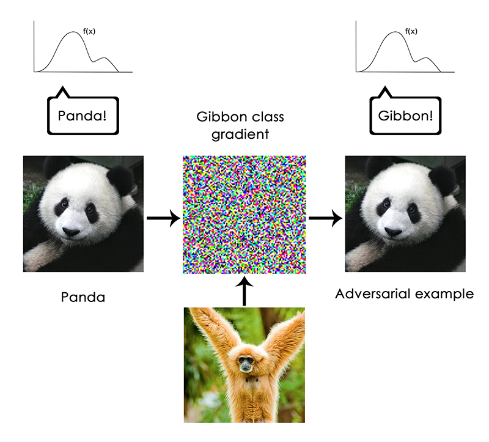

[The Limitations of Deep Learning](https://blog.keras.io/the-limitations-of-deep-learning.html)

Even neural networks with many layers are just pure functions that map inputs to outputs:

> That's the magic of deep learning: turning meaning into vectors, into geometric spaces, then incrementally learning complex geometric transformations that map one space to another. All you need are spaces of sufficiently high dimensionality in order to capture the full scope of the relationships found in the original data.

This means that the applications for deep learning are diverse; but many applications are still far out of reach:

> The space of applications that can be implemented with this simple strategy is nearly infinite. And yet, many more applications are completely out of reach for current deep learning techniques—even given vast amounts of human-annotated data. Say, for instance, that you could assemble a dataset of hundreds of thousands—even millions—of English language descriptions of the features of a software product, as written by a product manager, as well as the corresponding source code developed by a team of engineers to meet these requirements. Even with this data, you could *not* train a deep learning model to simply read a product description and generate the appropriate codebase

Neural networks lack multiple layers of abstractions and generalizations that humans apply; the author refers to this as "Local generalization versus extreme generalization".

> In short, deep learning models do not have any understanding of their input, at least not in any human sense. Our own understanding of images, sounds, and language, is grounded in our sensorimotor experience as humans—as embodied earthly creatures. Machine learning models have no access to such experiences and thus cannot "understand" their inputs in any human-relatable way. By annotating large numbers of training examples to feed into our models, we get them to learn a geometric transform that maps data to human concepts on this specific set of examples, but this mapping is just a simplistic sketch of the original model in our minds, the one developed from our experience as embodied agents—it is like a dim image in a mirror.

This leads to models that can be tricked:

> **There just seems to be fundamental differences between the straightforward geometric morphing from input to output that deep learning models do, and the way that humans think and learn.** 

## The Future of Deep Learning

https://blog.keras.io/the-future-of-deep-learning.html

> Now, imagine neural networks that would be "augmented" in a similar way with programming primitives such as `for` loops—but not just a single hard-coded `for` loop with a hard-coded geometric memory, rather, a large set of programming primitives that the model would be free to manipulate to expand its processing function, such as `if` branches, `while` statements, variable creation, disk storage for long-term memory, sorting operators, advanced datastructures like lists, graphs, and hashtables, and many more. The space of programs that such a network could represent would be far broader than what can be represented with current deep learning models, and some of these programs could achieve superior generalization power.
>
> In a word, we will move away from having on one hand "hard-coded algorithmic intelligence" (handcrafted software) and on the other hand "learned geometric intelligence" (deep learning). 

> A related subfield of AI that I think may be about to take off in a big way is that of *program synthesis*

> As you can see, is it highly reminiscent of machine learning: given "training data" provided as input-output pairs, we find a "program" that matches inputs to outputs and can generalize to new inputs. The difference is that instead of learning parameter values in a hard-coded program (a neural network), we generate *source code* via a discrete search process.

> Besides, backpropagation is end-to-end, which is a great thing for learning good chained transformations, but is rather computationally inefficient since it doesn't fully leverage the modularity of deep networks. To make something more efficient, there is one universal recipe: introduce modularity and hierarchy. So we can make backprop itself more efficient by introducing decoupled training modules with some synchronization mechanism between them, organized in a hierarchical fashion. This strategy is somewhat reflected in DeepMind's recent work on "synthetic gradients".

> **Currently, most of the job of a deep learning engineer consists in munging data with Python scripts, then lengthily tuning the architecture and hyperparameters of a deep network to get a working model—or even, to get to a state-of-the-art model, if the engineer is so ambitious.** 

>  a lot datasets would not contain enough information to develop a new complex model from scratch, and it will become necessary to leverage information coming from previously encountered datasets. Much like you don't learn English from scratch every time you open a new book

> **Additionally, a remarkable observation that has been made repeatedly in recent years is that training a *same* model to do several loosely connected tasks at the same time results in a model that is *better at each task*. For instance, training a same neural machine translation model to cover both English-to-German translation and French-to-Italian translation will result in a model that is better at each language pair. Training an image classification model jointly with an image segmentation model, sharing the same convolutional base, results in a model that is better at both tasks. And so on. This is fairly intuitive: there is always *some* information overlap between these seemingly disconnected tasks, and the joint model has thus access to a greater amount of information about each individual task than a model trained on that specific task only.**

> In a similar way, in the future, meta-learning systems will be able to assemble new programs by sifting through a global library of high-level reusable blocks.