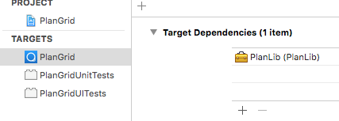
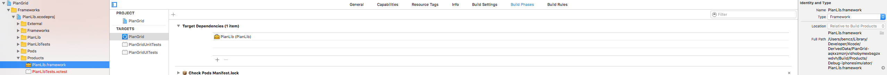
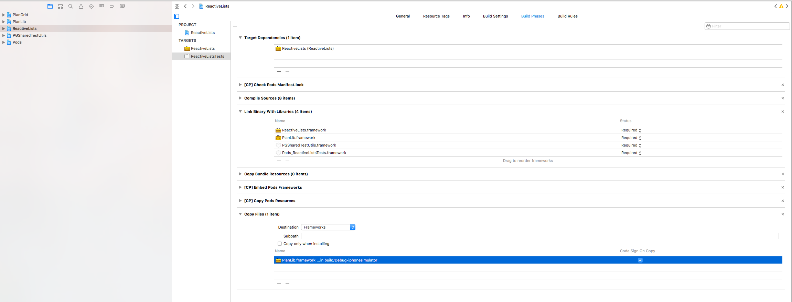

# Linking Internal Frameworks

This post describes how to link internal frameworks that are part of the same workspace but in different Xcode projects. It's not a complete description but instead a collection of a few gotchas that I ran into.

**Add Dependent Project as Subproject**

Even though the dependent project providing the internal library is part of the same workspace, it needs to be added as a reference tot he project that imports the library:

**Set up a Target Dependency**

Ensure that the dependent target is always built before the project that imports the dependency.

**Ensure the Path of the Build Product**

This should work by default; but it's important that the path of the imported build product is `Relative to Build Products`. This will avoid references to absolute file paths in the Xcode project file.

**Copy Frameworks**

If the tests depends on Frameworks these need to be copied as part of the test target's build phase:

It's a little unclear to me whether or not this step is actually necessary; there are some related discussions in the carthage repo:

- [Here](https://github.com/Carthage/Carthage/issues/635)
- [And here](https://github.com/Carthage/Carthage/issues/1615#issuecomment-281676402)

