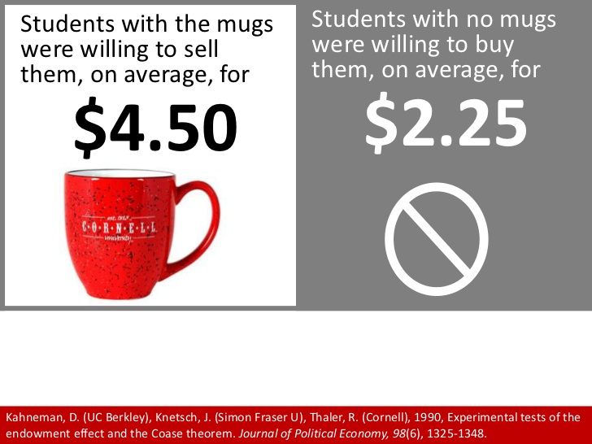
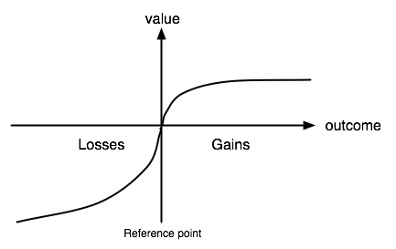
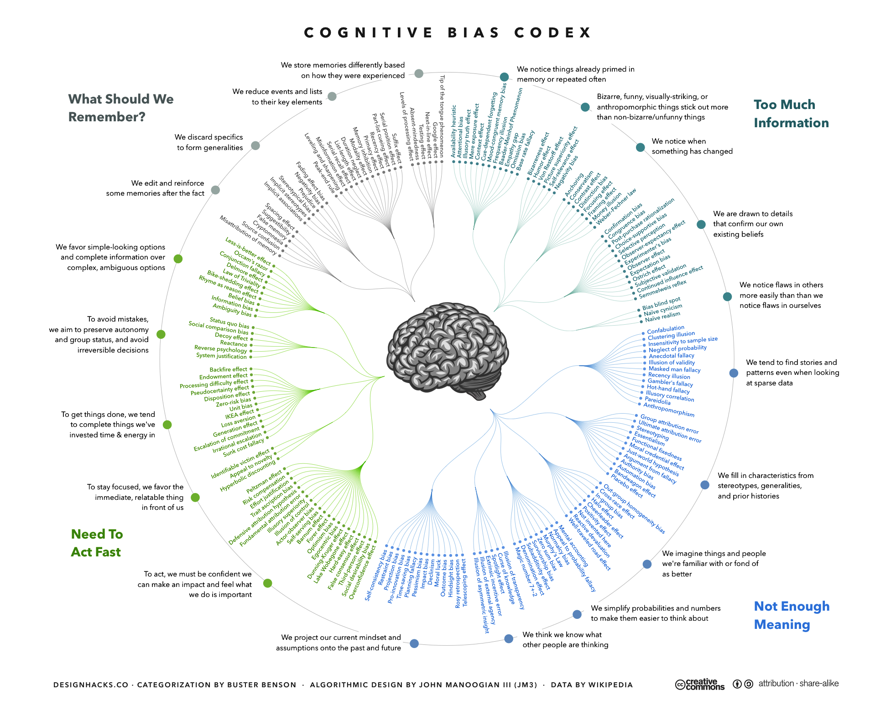

# About the Author

Richard H. Thaler is an economist who worked closely with psychologists Daniel Kahneman, Amos Tversky (and others) in shaping behavioral economics, a field that brings psychological insights to economics.

# Summary

The book details the rise of behavioral economics and the ongoing fight between behavioralists and traditionalists in economics. The book highlights many ways in which the assumptions of rational actors baked into traditional economics are provably incorrect. It also highlights how these assumptions can lead to poor economic policy.

# Quotes

## I Beginnings 1970-78

### 1. Supposedly Irrelevant Factors

Chapter discusses how many factors traditionally considered "irrelevant" are actually very relevant to the study of Economics.

- "Compared to this fictional world of Econs, Humans do a lot of misbehaving, and that means that economic models make a lot of bad predictions."
- "Of all the social scientists, economists carry the most sway when it comes to influencing public policy. In fact, they hold a virtual monopoly on giving policy advice. Until very recently, other social scientests were rarely invited to the table..."
- "[Another way in which Economics is] the most powerful of the social sciences [is] in an intellectual sense. That power derives from the fact that economics has a unified , core theory from which nearly everything else follows . If you say the phrase “ economic theory , ” people know what you mean . No other social science has a similar foundation."
  - "The core premise of economic theory is that people choose by optimizing."
- "To simplify somewhat we can say that **Optimization + Equilibrium = Economics**"
- "Theories based on the assumption that everyone is an Econ should not be discarded . They remain useful as starting points for more realistic models ."
- "Economists get in trouble when they make a highly specific prediction that depends explicitly on everyone being economically sophisticated."
- "We don’t have to stop inventing abstract models that describe the behavior of imaginary Econs . We do , however , have to stop assuming that those models are accurate descriptions of behavior , and stop basing policy decisions on such flawed analyses . And we have to start paying attention to those supposedly irrelevant factors , what I will call SIFs for short."

### 2. Endowment Effect

- "Both Dean and his friend found the decision of whether to sell or attend the game to be an easy one. The divinity school student invited someone to go to the game with him and enjoyed himself. Dean, meanwhile, got busy scoping out which basketball-loving professors also had lucrative consulting practices. He sold his tickets for several hundred dollars each. Both Dean and his friend thought the other’s behavior was nuts. Dean did not understand how his friend could possibly think he could afford to go to the game. His friend could not understand why Dean didn’t realize the tickets were free. That is the endowment effect. I knew it was real, but I had no idea what to do with it."

### 3. The List

Thaler trying to build studies out of a long list of "dumb people things do"

- **One of my favorites from the list of odd behaviors Thaler investigated:** Stanley mows his lawn every weekend and it gives him terrible hay fever. I ask Stan why he doesn’t hire a kid to mow his lawn. Stan says he doesn’t want to pay the USD 10. I ask Stan whether he would mow his neighbor’s lawn for USD 20 and Stan says no, of course not.

- "I found the concept of hindsight bias fascinating , and incredibly important to management . One of the toughest problems a CEO faces is convincing managers that they should take on risky projects if the expected gains are high enough . Their managers worry , for good reason , that if the project works out badly , the manager who championed the project will be blamed whether or not the decision was a good one at the time . Hindsight bias greatly exacerbates this problem , because the CEO will wrongly think that whatever was the cause of the failure , it should have been anticipated in advance . And , with the benefit of hindsight , he always knew this project was a poor risk . What makes the bias particularly pernicious is that we all recognize this bias in others but not in ourselves ."

- Introduces the idea of "bounded rationality" - there are pretty strict limits to rationality of individuals and traditional Economists don't acknowledge these limits

  - > Herbert Simon, a polymath academic who spent most of his career at Carnegie Mellon University. Simon was well known in nearly every field of social science, including economics, political science, artificial intelligence, and organizational theory, but most germane to this book, he wrote about what he called “bounded rationality” well before Kahneman and Tversky came along.
    >
    > Thaler, Richard H.. Misbehaving: The Making of Behavioral Economics (p. 23). W. W. Norton & Company. Kindle Edition. 

### 4. Value Theory

Thaler's introduction to prospect theory.

- Prospect Theory paper by Tversky and Kahnemann

  - "The organizing principle was the existence of two different **kinds of theories: normative and descriptive**."

    - Authors believe traditional economics is only a normative model (how people should behave) and should not be used as descriptive (describing the actual behavior observed in the world) 

  - Introduces the idea of **loss aversion**

    - > Daniel Kahneman, who won a Nobel Memorial Prize in Economics for his work developing prospect theory.
      > Prospect theory is a behavioral economic theory that describes the way people choose between probabilistic alternatives that involve risk, where the probabilities of outcomes are known (=/uncertainty = do not know the possible outcomes and/or probabilities). The theory states that people make decisions based on the potential value of losses and gains rather than the final outcome, and that people evaluate these losses and gains using certain heuristics. The model is descriptive: it tries to model real-life choices, rather than optimal decisions, as normative models do.

- **Another favorite from the book!** "Here is a test to see if you are a good intuitive Pythagorean thinker. Consider two pieces of railroad track, each one mile long, laid end to end (see figure 1). The tracks are nailed down at their end points but simply meet in the middle. Now, suppose it gets hot and the railroad tracks expand, each by one inch. Since they are attached to the ground at the end points, the tracks can only expand by rising like a drawbridge. Furthermore, these pieces of track are so sturdy that they retain their straight, linear shape as they go up. (This is to make the problem easier, so stop complaining about unrealistic assumptions.) Here is your problem: Consider just one side of the track. We have a right triangle with a base of one mile, a hypotenuse of one mile plus one inch. What is the altitude? In other words, by how much does the track rise above the ground?"

  - Highlights normative vs. descriptive theory

    - > we will use the Pythagorean theorem as both our normative and descriptive model and predict that people will come up with something near 30 feet . For this problem , that is a terrible prediction . **The average answer that people give is about 2 inches** (!!).

- Normative vs descriptive theory of the firm

  > William Baumol had proposed an alternative to the traditional (normative) theory of the firm (which assumes profit maximization). He postulated that firms maximize their size, measured for instance by sales revenue, subject to a constraint that profits have to meet some minimum level. I think sales maximization may be a good descriptive model of many firms.

- "The first thing I took from my early glimpse of prospect theory was **a mission statement** : Build descriptive economic models that accurately portray human behavior."

- "**People think about life in terms of changes , not levels** . They can be changes from the status quo or changes from what was expected , but whatever form they take , it is changes that make us happy or miserable . That was a big idea ."

- "The reason why people are risk - seeking for losses is the same logic that applies to why they are risk - averse for gains . In the case of problem 2 , the pain of losing the second hundred dollars is less than the pain of losing the first hundred , so subjects are ready to take the risk of losing more in order to have the chance of getting back to no loss at all . They are especially keen to eliminate a loss altogether because of the third feature captured in figure 3 : loss aversion."

- "Roughly speaking , losses hurt about twice as much as gains make you feel good ."

### 5. California Dreamin

Personal detour on how Thaler got invovled in more behavioral economics work.

- To call academic writing dull is giving it too much credit . Yet to many , dull writing is a badge of honor . To write with flair signals that you don’t take your work seriously and readers shouldn’t either . † “ Prospect Theory ” is hardly an easy read , but the writing was crystal clear because of their endless editing and Amos’s perennial goal of “ getting it right . ”

### 6. The Gauntlet

First experience of resistance from traditional economists

- "Economists do not put much stock in the answers to hypothetical questions , or survey questions in general for that matter . Economists say they care more about what people do as opposed to what they say they would do." [...] "I found the idea that you could just ask people questions and take their answers seriously to be quite liberating."

- Normative managament behavior says, RE hiring workers (using "marignal analysis"):

  - "Keep hiring workers until the cost of the last worker equals the increase in revenue that the worker produces . These results may seem innocuous enough , but in the late 1940s a debate raged in the American Economic Review about whether real managers actually behaved this way."
  - Turns out, this is not actually what managers do:
  - "Instead , they reported trying to sell as much of their product as they could , and increasing or decreasing the workforce to meet that level of demand."

- "It is in the context of this debate that Milton Friedman , a young economist headed for fame , weighed in . In an influential essay called “ The Methodology of Positive Economics , ” Friedman argued that it was silly to evaluate a theory based on the realism of its assumptions . What mattered was the accuracy of the theory’s predictions . ( He is using the word “ positive ” in his title here the way I use “ descriptive ” in this book , that is , as a contrast to normative . )"

- From Friedmans paper: "excellent predictions would be yielded by the hypothesis that the billiard player made his shots **as if** he knew the complicated mathematical formulas that would give the optimum direction of travel , could estimate by eye the angles etc . , describing the location of the balls , could make lightning calculations from the formulas , and could then make the balls travel in the direction indicated by the formulas . Our confidence in this hypothesis is not based on the belief that billiard players , even expert ones , can or do go through the process described ; it derives rather from the belief that , unless in some way or other they were capable of reaching essentially the same result , they would not in fact be expert billiard players ."

- "A good theory , it seemed , could not be defeated using just survey data , even if the defenders of the theory presented no data of their own ."

- "Fortunately , Kahneman and Tversky had provided an answer to the “ as if ” question . Both their work on heuristics and biases as well as that on prospect theory clearly showed that people did not act “ as if ” they were choosing in accordance with the rational economic model."

- "My main point was that economics is supposed to be a theory of everyone , not only experts . An expert billiard player might play as if he knows all the relevant geometry and physics , but the typical bar player usually aims at the ball closest to a pocket and shoots , often missing . If we are going to have useful theories about how typical people shop , save for retirement , search for a job , or cook dinner , those theories had better not assume that people behave as if they were experts."

- Traditional economists say incentives matter. And that surveys don't work because stakes are too low. So on experiment increased stakes:

  - > So they ran the experiments for real money , and much to their surprise , the frequency and severity of the preference reversals actually increased . **Raising the stakes made things worse .**

- "Because learning takes practice , we are more likely to get things right at small stakes than at large stakes . This means critics have to decide which argument they want to apply . If learning is crucial , then as the stakes go up , decision - making quality is likely to go down ."

- Counterpoint to the "invisible handwave" that economists argue drives rationality in markets:

  - > The vague argument is that markets somehow discipline people who are misbehaving . Handwaving is a must because there is no logical way to arrive at a conclusion that markets transform people into rational agents . Suppose you pay attention to sunk costs , and finish a rich dessert after a big dinner just because you paid for the dessert . What will happen to you ? If you make this mistake often you might be a bit chubbier , but otherwise you are fine .

  - > "Sometimes the invisible handwave is combined with the incentives argument to suggest that when the stakes are high and the choices are difficult , people will go out and hire experts to help them . The problem with this argument is that it can be hard to find a true expert who does not have a conflict of interest ."

## II Mental Accounting 1979 - 85

### 7. Bargains and Rip-Offs

Tversky introduces the idea of transaction utility (in addition to the existing acquisition utility) to how folks evaluate potential purchases and determine their value.

- > If you understand opportunity costs and you have a ticket to a game that you could sell for USD 1,000 , it does not matter how much you paid for the ticket . The cost of going to the game is what you could do with that USD 1,000 . You should only go to the game if that is the best possible way you could use that money . Is it better than one hundred movies at USD 10 each ? [...] Still , anyone who tried to make every decision in this manner would be paralyzed . How can I possibly know which of the nearly infinite ways to use $ 1,000 will make me happiest ?

- Tverskys model for evaluating purchases

  - "Eventually I settled on a formulation that involves two kinds of utility : **acquisition utility** and **transaction utility**."
    - Acquisition utility: traditional measure of value. "suggests, it is the surplus remaining after we measure the utility of the object gained and then subtract the opportunity cost of what has to be given up."
    - Transaction utility: "It is defined as the difference between the price actually paid for the object and the price one would normally expect to pay, the reference price. Suppose you are at a sporting event and you buy a sandwich identical to the one you usually have at lunch, but it costs triple the price. The sandwich is fine but the deal stinks. It produces negative transaction utility, a **“rip-off.”** In contrast, if the price is below the reference price, then transaction utility is positive, a **“bargain,”** like Maya’s extra-large quilt selling for the same price as a smaller one."

- **Another favorite:** Transaction utility of buying a beer while lying at the beach and friend either gets it from a fancy store or rundown liquor store

  - The variations appear in parentheses and brackets. 
  - *You are lying on the beach on a hot day. All you have to drink is ice water. For the last hour you have been thinking about how much you would enjoy a nice cold bottle of your favorite brand of beer. A companion gets up to go make a phone call and offers to bring back a beer from the only nearby place where beer is sold **(a fancy resort hotel) [a small, rundown grocery store]**. He says that the beer might be expensive so asks how much you are willing to pay for the beer. He says he will buy the beer if it costs as much or less than what you state. But if it costs more than the price you state, he will not buy it. You trust your friend, and there is no possibility of bargaining with the **(bartender) [store owner]**. What price will you tell him?*
  - The median answers, adjusted for inflation, **were USD 7.25 and USD 4.10** (for same beer!).
  - Crucially , the **consumption act is identical in the two situations** . The respondent gets to drink one bottle of his favorite brand of beer on the beach . He never enters or even sees the establishment from which the beer has been purchased , and thus does not consume any ambience , positive or negative .
  - "In economists ’ lingo , the situation is **incentive compatible** ." (But factually they are quite obviously not)
  - "Why do the respondents care where the beer was bought ? One reason is expectations . People expect prices to be higher at a fancy hotel , in part because the costs are quite obviously higher . Paying seven dollars for a beer at a resort is annoying but expected ; paying that at a bodega is an outrage ! This is the essence of transaction utility . **Econs do not experience transaction utility** . For them , the purchase location is another supposedly irrelevant factor , or SIF"
  - "For those who are at least living comfortably, negative transaction utility can prevent our consuming special experiences that will provide a lifetime of happy memories, and the amount by which the item was overpriced will long be forgotten. Good deals, on the other hand, can lure all of us into making purchases of objects of little value. Everyone has items in their closets that are rarely worn but were “must buys” simply because the deal was too good, and of course somewhere in the garage or attic is our version of Maya’s quilt. [Example of woman buying oversized quilt, too big for her bed, because it was as cheap as a smaller one...]"

- On store discounts

  - > If a retailer known for frequent discounting tries to wean their customers away from expecting great deals , it can struggle . Several retailers have tried over the years to entice customers with something called “ everyday low pricing , ” but these experiments usually fail

  - **In 2012 less than 1% of JC Penney's revenues came from full-price transactions**

### 8. Sunk Costs

- > Vince paid $ 1,000 to an indoor tennis club that entitled him to play once a week for the indoor season . After two months he developed tennis elbow , which made playing painful . He continued to play in pain for three more months because he did not want to waste the membership fee . He only stopped playing when the pain became unbearable.

- >  Paying USD 100 for a ticket to a concert that you do not attend feels a lot like losing USD 100 . To continue the financial accounting analogy , **when you buy the ticket and then fail to use it you have to “ recognize the loss ” in the mental books you are keeping . Going to the event allows you to settle this account without taking a loss .**

- Gourville and Soman found that attendance at the club jumps the month after the bill arrives , then tails off over time until the next bill arrives . They called this phenomenon “ payment depreciation , ” meaning that the effects of sunk costs wear off over time .

- **Another favorite example:** "A similar result was found by psychologist Hal Arkes, now at Ohio State University, who conducted a nice experiment with his graduate student Catherine Blumer. Students who were in line to buy season tickets to a campus theater company were randomly chosen to receive either a small or large discount on the purchase price. An important feature of the design of this experiment is that customers were already committed to make the purchase at full price before they got their discount, so experimenters could presume that the subjects who paid a discounted price valued the product as much as those who paid full price. Arkes and Blumer found that sunk costs did matter, but only for one semester. **Those who paid full price went to more events in the fall semester, but by the spring attendance was the same across the three groups; apparently the students had gone to enough plays to feel they had gotten their money’s worth, or had just forgotten the original purchase altogether. So sunk costs matter, at least for a while, but may be forgotten eventually.**"

- On the interesting wine experiments: 

  - One, a retired engineer, wrote: “I understand that, emotion aside, replacement cost is relevant for economic decisions. However, my ideal feeling will be if my ’89 and ’90 futures increase enough in value to sell half for my total cost and drink the balance with only pleasure in mind, not money. [...] You see what he is saying? If the wine doubles in value and he sells half, then he can drink the rest as “free.” Brilliant! This ploy will make each bottle he drinks render considerable transaction utility.” [Same strategy I pursue, e.g. with Ethereum holdings :)]

  - > some inconsistent thinking going on . I**t can’t be right that acquiring the wine is just an “ investment ” and the later consumption of the wine either costs nothing or saves money . Surely the support of an expensive wine drinking habit must involve spending money at some point !** Eldar and I published a paper on this , with a title that fully summarizes the findings : **“ Invest Now , Drink Later , Spend Never . ”**

  - > There is an interesting side note to this experiment . The lottery offering up the $ 75 bottle of wine generated 178 respondents from a relatively affluent group of readers . That is 42 cents per reply , and they had to pay their own postage ! **If you want to get people to do stuff , lotteries can be very effective motivation .**

- On sunk costs and the authors inability to simply delete paragraphs he wrote that didn't make it into the book (and how to work around these mental issues):

  - > Merely having a place where these pieces are stored in a folder on my computer labeled “ outtakes ” has been enough to reduce the pain of cutting some of my favorite passages , a pain that can hurt as much as wearing those expensive , ill - fitting shoes . The bigger lesson is that once you understand a behavioral problem , you can sometimes invent a behavioral solution to it . Mental accounting is not always a fool’s game.

### 9. Buckets & Budgets

Why money is less fungible than traditional economists think.

- "The existence of budgets can violate another first principle of economics : money is fungible , meaning that it has no labels restricting what it can be spent on."

- People put money in a "Gas bucket". If gas prices go down they don't spend that money on something else; but unfortunately spend it on more expensive gas instead...

  - > **The shift toward higher grades of gasoline was fourteen times greater than would be expected in a world in which money is treated as fungible** .

- Impact of tax incentives, low interest rates and mortage brokers on the change of treating home equity as a "safe" mental account that shouldn't be touched

  - > When the housing bubble arrived and drove up prices, homeowners were told they could lower their mortgage payment and take out a bit of extra cash too, to refinish the basement and buy a big-screen television. At this point, home equity ceased to be a “safe” mental account. This fact is illustrated by a change in the borrowing behavior of households with a head that is aged seventy-five or older. In 1989 only 5.8% of such families had any mortgage debt. By 2010, the fraction with debt rose to 21.2%. For those with mortgage debt, the median amount owed also rose over this period, from $35,000 to $82,000 (in 2010 dollars).

- > **Like most aspects of mental accounting , setting up non - fungible budgets is not entirely silly** . Be it with mason jars , envelopes , or sophisticated financial apps , a household that makes a serious effort to create a financial plan will have an easier time living within its means . The same goes for businesses , large or small . But sometimes those budgets can lead to bad decision - making , such as deciding that the Great Recession is a good time to upgrade the kind of gasoline you put in your car .

### 10. At the Poker Table

My money vs. house money and other mental accounting quirks.

- "Losing money in the poker account only changes behavior while you are still playing poker . This situation , in which a person is “ behind ” in a particular mental account , is tricky to handle in prospect theory , something Kahneman and Tversky knew well .""

- "My impression was that players who were behind were attracted to small bets that offered a slim chance for a big win ( such as drawing to an inside straight ) but disliked big bets that risked a substantial increase to the size of their loss , even though they offered a higher probability of breaking even ."

- On "house money":

  - > you may see what I call “two-pocket” mental accounting. Take a player who has brought USD 300 to the casino to bet, and finds himself up USD 200 early in the evening. He will put USD 300 into one pocket and think of that money as his own money, and put the USD 200 worth of chips he has won in a different pocket (or more likely, on the table, ready to bet). When it comes to “house money,” the expression “easy come, easy go” applies.

- On problem described on page 83:

  - >  Instead of the simple prediction from prospect theory that people will be risk-seeking for losses, in problem 2 a loss of $30 does **not generate risk-taking preferences when there is no chance to break even.‡ But when given that chance, in problem 3, a majority of the subjects opt to gamble.**

- "Once you recognize the **break-even effect** and the **house money effect** , it is easy to spot them in everyday life ."

- > **Gambling when behind in an effort to break even can also be seen in the behavior of professional investors** . Mutual fund portfolio managers take more risks in the last quarter of the year when the fund they are managing is trailing the benchmark index ( such as the S & P 500 ) to which their returns are compared .

- > A good rule to remember is that people who are threatened with big losses and have a chance to break even will be unusually willing to take risks , even if they are normally quite risk averse . Watch out !

## III Self-Control: 1975-88

### 11. Willpower? No Problem

### 

# Other Amusing Examples of Irrationality 

- Author increased max score on his test from 100 to 137 b/c students achieving 70% of test scores felt tests were too hard. Despite still achieving 70% on new scale, students were a lot happier because the average numerical score was now 96 points.
- "An Econ would also not expect a gift on the day of the year in which she happened to get married , or be born . What possible difference can a date make ? In fact , Econs would be perplexed by the entire idea of gifts . An Econ would know that cash is the best possible gift ; it allows the recipient to buy whatever is optimal . But unless you are married to an economist , I don’t advise giving cash on your next anniversary."
- "Let a six - year - old girl with brown hair need thousands of dollars for an operation that will prolong her life until Christmas , and the post office will be swamped with nickels and dimes to save her . But let it be reported that without sales tax the hospital facilities of Massachusetts will deteriorate and cause a barely perceptible increase [...] the hospital stands in for concept Schelling calls a **“ statistical life , ” as opposed to the girl , who represents an “ identified life . ”** We occasionally run into examples of identified lives at risk in the real world , such as the thrilling rescue of trapped miners . As Schelling notes , we rarely allow any identified life to be extinguished solely for the lack of money . But of course thousands of “ unidentified ” people die every day for lack of simple things like mosquito nets , vaccines , or clean water"
- Two seemingly identical cases, two very different responses [Endowment effect / loss aversion example]

  - "**A**. Suppose by attending this lecture you have exposed yourself to a rare fatal disease. If you contract the disease you will die a quick and painless death sometime next week. The chance you will get the disease is 1 in 1,000. We have a single dose of an antidote for this disease that we will sell to the highest bidder. If you take this antidote the risk of dying from the disease goes to zero. What is the most you would be willing to pay for this antidote? (If you are short on cash we will lend you the money to pay for the antidote at a zero rate of interest with thirty years to pay it back.) 
  - **B**. Researchers at the university hospital are doing some research on that same rare disease. They need volunteers who would be willing to simply walk into a room for five minutes and expose themselves to the same 1 in 1,000 risk of getting the disease and dying a quick and painless death in the next week. No antidote will be available. What is the least amount of money you would demand to participate in this research study?"
  - "the answers to the two questions were not even close to being the same . Typical answers ran along these lines : I would not pay more than  USD 2,000 in version A but would not accept less than USD 500,000 in version B . In fact , in version B many respondents claimed that they would not participate in the study at any price ."

# Terms

#### The Endowment Effect (initially found by Thaler)

> In psychology and behavioral economics, the **endowment effect** (also known as divestiture aversion and related to the mere ownership effect in social psychology) is **the hypothesis that people ascribe more value to things merely because they own them.

Related quote:

> Rosett said he occasionally drank one of those bottles on a special occasion , but would never dream of paying USD 100 to acquire one . He also did not sell any of his bottles to Woody . This is illogical . If he is willing to drink a bottle that he could sell for USD 100 , then drinking it has to be worth more than USD 100 . But then , why wouldn’t he also be willing to buy such a bottle ? In fact , why did he refuse to buy any bottle that cost anything close to USD 100 ? As an economist , Rosett knew such behavior was not rational , but he couldn’t help himself . 
>
> Thaler, Richard H.. Misbehaving: The Making of Behavioral Economics (p. 17). W. W. Norton & Company. Kindle Edition. 

### Loss Aversion

People evaluate prospects from a specific reference point. Losses from that reference point are considered more strongly than equal sized gains.

# Other Research

## A list of all cognitive biases

https://en.wikipedia.org/wiki/List_of_cognitive_biases

